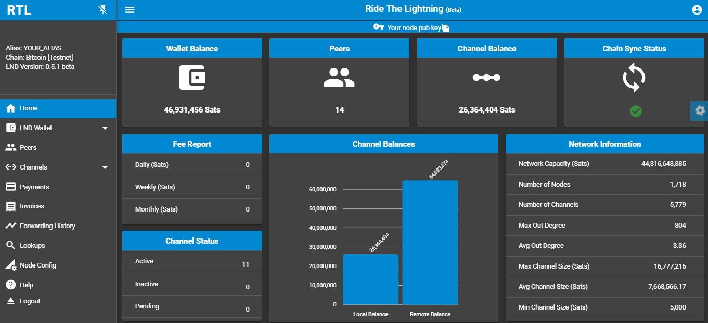
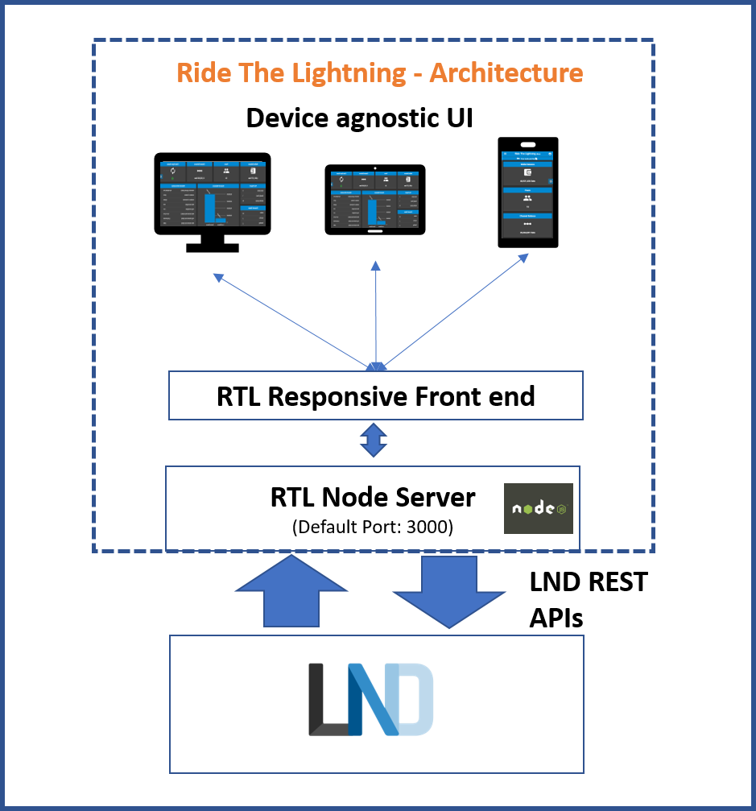

## Ride The Lightning (RTL)


<a href="https://snyk.io/test/github/ShahanaFarooqui/RTL"></a>
[](https://github.com/DAVFoundation/captain-n3m0/blob/master/LICENSE)
### Stable Release: v0.3.0

**Intro** -- [Application Features](docs/Application_features.md) -- [Road Map](docs/Roadmap.md) -- [LND API Coverage](docs/LNDAPICoverage.md) -- [Application Configurations](docs/Application_configurations)

* [Introduction](#intro)
* [Architecture](#arch)
* [Prerequisites](#prereq)
* [Installation](#install)
* [Prep For Execution](#prep)
* [Start The Server](#start)
* [Access The Application](#access)
* [Troubleshooting](#trouble)

### <a name="intro"></a>Introduction
RTL is a full function, device agnostic web user interface for Lightning Network Daemon, to help manage lightning node operations.
Lightning Network Daemon is an implementation of Lightning Network BOLT protocol by [Lightning Labs](https://lightning.engineering/).

Pre-requisite for running RTL is a functioning and synced LND node. You can setup your own node, by following the below guides:
* Windows/Mac users can follow Pierre Rochard's [Node Launcher](https://github.com/lightning-power-users/node-launcher)
* Linux or Raspberry Pi users can follow Stadicus's [guide](https://github.com/Stadicus/guides/blob/master/raspibolt/README.md)

RTL source code is available at this [repo](https://github.com/ShahanaFarooqui/RTLFullApplication)

For detailed screenshots and UI operation guide you can visit our [medium post](https://medium.com/@suheb.khan/how-to-ride-the-lightning-447af999dcd2)

RTL is already available on:
* [RaspiBlitz](https://github.com/rootzoll/raspiblitz)
* [Nodl](https://www.nodl.it/)
* [BTCPayserver](https://github.com/btcpayserver/btcpayserver-docker)

Docker Image: https://hub.docker.com/r/shahanafarooqui/rtl

### <a name="arch"></a>Architecture


### <a name="prereq"></a>Prerequisites
* Functioning and synced LND lightning node.
* Node.js, which can be downloaded [here](https://nodejs.org/en/download/)
* Recommended Browsers: Chrome, Firefox, MS Edge

### <a name="install"></a>Installation
#### First time setup
* Fetch sources from the RTL git repository, by executing the below on the command prompt:

`$ git clone https://github.com/ShahanaFarooqui/RTL.git`
* Change directory to RTL folder:

`$ cd RTL`
* Fetch the dependencies and build the application by running:

`$ npm install`

#### Or: Update existing build
```
$ cd RTL
$ git reset --hard HEAD
$ git clean -f -d
$ git pull
$ npm install
```
### <a name="prep"></a>Prep for Execution
RTL requires its own config file `RTL.conf`, to start the server and provide user authentication on the app.

* Rename `sample-RTL.conf` file to `RTL.conf`.
* Locate the complete path of the readable macroon file (admin.macroon) on your node and the lnd.conf file.
* Modify the `RTL.conf` file per the example file below

Example RTL.conf:
```
[Authentication]
macaroonPath=C:\Users\<user>\AppData\Local\Lnd\data\chain\bitcoin\testnet
nodeAuthType=CUSTOM
lndConfigPath=C:\Users\<user>\AppData\Local\Lnd\lnd.conf
rtlPass=***

[SSO]
rtlSSO=0
rtlCookiePath=C:\RTL\cookies\auth.cookie
logoutRedirectLink=/login

[Settings]
flgSidenavOpened=true
flgSidenavPinned=true
menu=Vertical
menuType=Regular
theme=dark-blue
satsToBTC=false
lndServerUrl=https://192.168.0.0:8080/v1
bitcoindConfigPath=
enableLogging=false
port=3000
```
For details on all the configuration options refer to [this page](https://github.com/ShahanaFarooqui/RTL/blob/master/Application_configurations).

#### User Authentication on RTL
RTL requires the user to be authenticated by the application first, before allowing access to LND functions.
There are two options to configure authentication on RTL, depending on the `nodeAuthtype` value provided in RTL.conf.

* Option 1: `nodeAuthType=DEFAULT`; Password provided in lnd.conf for the rpc setting for bitcoind will be used for authentication.
* Option 2: `nodeAuthType=CUSTOM`; Specific password must be provided in RTL.conf (in plain text) for authentication. Password should be set with `rtlPass=<user defined>` in the [Authentication] section of RTL.conf

### <a name="start"></a>Start the Server
Run the following command:

`$ node rtl` 

If the server started successfully, you should get the below output on the console:

`$ Server is up and running, please open the UI at http://localhost:3000`

#### Optional: Running RTL as a service (Rpi or Linux platform users)
In case you are running a headless Rpi or a Linux node, you can configure RTL as a service.

* Create RTL systemd unit and with the following content. Save and exit.
```bash
# Raspibolt RTL: systemd unit for RTL
# /etc/systemd/system/RTL.service

[Unit]
Description=RTL daemon
Wants=lnd.service
After=lnd.service

[Service]
ExecStart=/usr/bin/node <Full path of the RTL folder>/rtl
User=<user>
Restart=always
TimeoutSec=120
RestartSec=30

[Install]
WantedBy=multi-user.target
```

* enable and start RTL
```
$ sudo systemctl enable RTL
$ sudo systemctl start RTL
```
* montior the RTL log file in realtime(exit with Ctrl-C)

`$ sudo journalctl -f -u RTL`

### <a name="access"></a>Accessing the Application
You can access the application in multiple setups (Please make note of the 4th exception):
1. Same device as the server:
Open your browser at the following address: http://localhost:3000 to access the RTL application.

2. Remotely from another device on the same local network (home network) as the node(RTL server+LND running on the same device):
* Ensure that the if a firewall running on your node, it allows access on port 3000 (or the custom port configured for RTL).
* Determine the IP address of your node to access the application.
E.g. if the IP address of your node is 192.168.0.15 then open your browser at the following address: http://192.168.0.15:3000 to access RTL.

3. Config tweaks for running RTL server and LND on separate devices on the same network can be found [here](docs/RTL_setups.md).

4. Any Other setup: **Please be advised, if you are accessing your node remotely via RTL, its critical to encrypt the communication via use of https. You can use solutions like nginx and letsencrypt or TOR to setup secure access for RTL.** 
- Sample SSL setup guide can be found [here](docs/RTL_SSL_setup.md)
- (For advanced users) A sample SSL guide to serve remote access over an encrypted Tor connection can be found [here](docs/RTL_TOR_setup.md)

### <a name="trouble"></a>Troubleshooting
In case you are running into issues with the application or if you have feedback, feel free to open issues on our github repo.
You can also reach out to us via twitter DM on [@Sauby_k](https://twitter.com/sauby_k) or [@RTL_App](https://twitter.com/RTL_App). Thanks for your interest.
