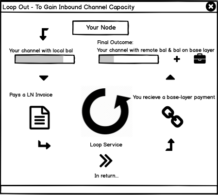
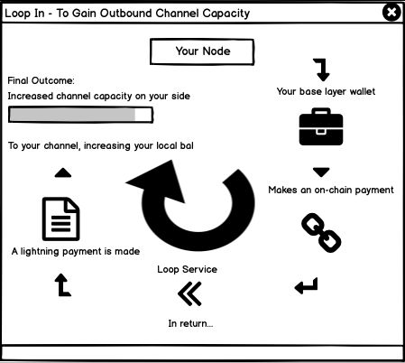

[Intro](../README.md) -- [Application Features](Application_features.md) -- **Road Map** -- [LND API Coverage](LNDAPICoverage.md) -- [Application Configurations](Application_configurations)

# Product Roadmap for RTL Application

## High Level Goals

### Improved UX
Current focus is on complete over-haul of the UX, including the mobile interfaces. Primary user persona for RTL is 'Routing Node Operator'. The UX will be optimized for effective node operation. There will be special focus on Dashboard, Channel Management and Routing tracking.

We believe UX improvement is a never-ending cycle. And, we must keep the UI/UX fresh and optimal with ongoing user feedback and inputs from UX subject-matter-experts. Contribution on UX suggestions is always welcome. 

### Automated Testing
As the functional complexity increases, we need to add automated testing to ensure quality and less bugs. Another area, where developer contribution is more than welcome.

### LND Loop Integration
LND's Loop-Out and Loop-In are important tools for channel re-balancing and will be integrated with RTL UI in the near future.
* Loop-Out

* Loop-In

### Eclair
Support Eclair implementation.

### Advanced Node Monitoring
Active node monitoring may be required to ensure reliability of routing nodes. Monitoring can include generating alerts for out-of-balance channels, inactive channels, disconnected peers, low activity channels etc. This feature will be required for professional node operaters running commercial routing nodes with a need to react to signals, requiring specific action to be taken.

### Advanced Multi-node Management
RTL currently allows managing multiple nodes (LND or C-Lightning), via single UI. More sophistication can be built on multi-node management, with advanced top level dashboards, which summarize node level summary in a single dashboard. This feature may be required for professional node operators, who are running commercial routing nodes.

### RTL installer
Automate RTL setup so that installation process is simpler than the current method of following the steps provided in the Readme file. This should also help with configuration of nginx and letsencrypt, to enable access via https. Contribution on this is more than welcome.

### Multi-Language Support
We can provide a customizable framework for multi-language support. But to extend support for other languages would require contribution from the development community, to use the framework and create multi-language support

